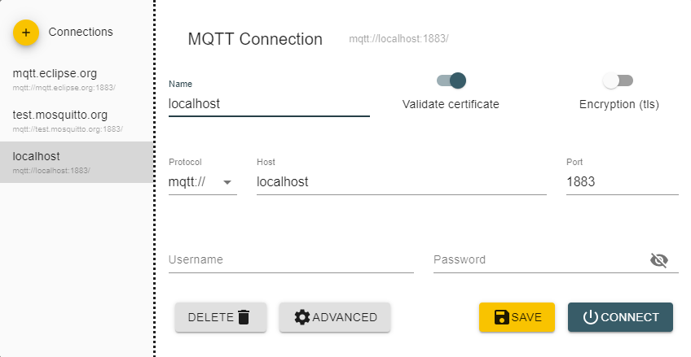
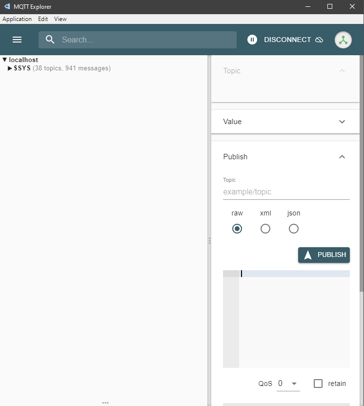
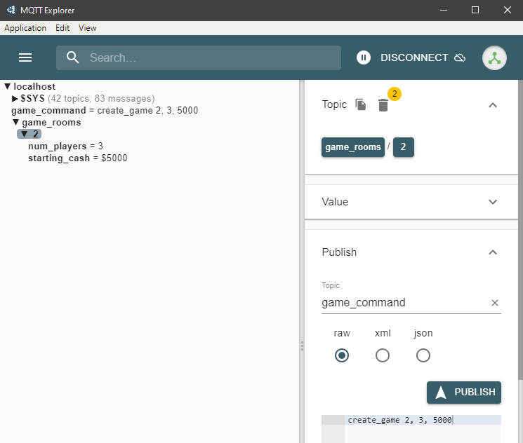
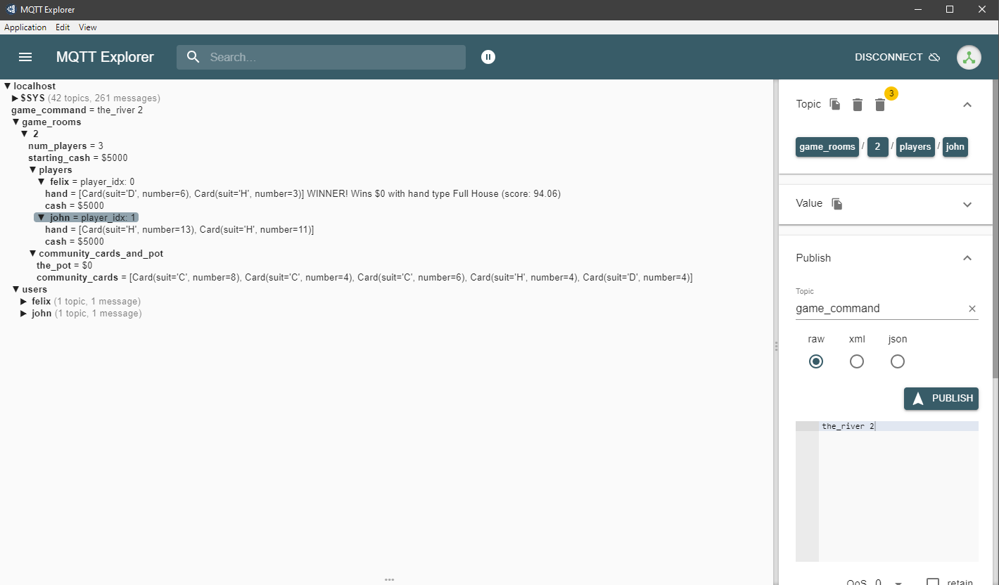

# Texas Hold'em in MQTT (ee5450-module-1-summative)
## Project Overview
Welcome to Texas Hold'em! This is a popular variant of Poker with community cards.

[How to play Texas Hold'em](https://bicyclecards.com/how-to-play/texas-holdem-poker/)

This project aims to play Texas Hold'em using the MQTT subscribe-publish protocol. To do so, we must install some
prerequisites:
- For the MQTT broker, download the [Mosquitto broker](https://mosquitto.org/download/).
- To run the server client on Pycharm, install [asyncio-mqtt](https://github.com/sbtinstruments/asyncio-mqtt) with 
  `pip install asyncio-mqtt`. This is an MQTT protocol based on paho-mqtt 
  (note: installing asyncio-mqtt will automatically install paho-mqtt).
- To simulate a user client, download [MQTT Explorer](http://mqtt-explorer.com/).

Once finished with the installations:
- Run `poker_mqtt`. This will run the client indefinitely.
  Note that the server will be run on 'localhost' by default, but this can be changed on line 14.
- Run MQTT Explorer. Click on `+ Connections`, and set the name and the host to "localhost" as shown, and
   click `Connect`:
  


- You will be brought to the screen below. This simulates the user (player) client, and nicely shows all the topics
and messages the user is subscribed to. The user is subscribed to ALL topics by default, and that is a necessity
for this project.
  


You are now ready to play the game. As a player, you will perform your commands by publishing certain messages
on specific topic channels. The next section will show how it's done. 

If you'd just like a quick simulation instead,
skip the next section and go straight to section **Example Game Simulation**.

## Game Commands using MQTT Explorer
As you can see from the screenshot above, you can configure which topics to publish to, write your messages in the
input box at the bottom right, and `Publish` the messages. Here I will explain the strict protocol you must follow.

For every message you publish, the topic should be "game_command". Also make sure that the message type is set to `raw`.

### 1. create_game
    Creates a game according to user input parameters, and adds the game to the game database.

    Topic: "game_command"
    Message format: "create_game game_number, num_players, starting_cash" (Important: the three parameters MUST be
                    separated by a comma!"

    Example: User publishes string message "create_game 2, 3, 5000" under topic "game_command/create" to create a 
             new game with room_number=2, num_players=3, and starting_cash=5000
After clicking `Publish`, it should look like this:



### 2. create_user
    Adds a user with the input username to the user database, with a randomly generated password.
    The user must publish a message of his desired username under the designated topic and message format below.

    Topic: "game_command"
    Message format: "create_user username"

    Example: User publishes string message "create_user john_doe" under topic "user_command/create" to create a new
             user with username john_doe

### 3. add_player_to_game
    Adds a player to a game that exists in the database.

    Topic: "game_command"
    Message format: "add_player_to_game game_number, username" (Important: the parameters MUST be
                    separated by a comma!"

    Example: User publishes string message "add_player_to_game 3, john_doe" under topic "game_command"
             to add user john_doe to game room number 3

### 4. init_game
    Deals the initial hands for each player.

    Topic: "game_command"
    Message format: "init_game room_number"

    Example: To do the initial deal for game room 2, the user would publish "init_game 2" under topic "game_command".

### 5. bet
    Deals the initial hands for each player.

    Topic: "game_command"
    Message format: "bet room_number, username, bet_amount"

    Example: To do the initial deal for game room 2, the user would publish "init_game 2" under topic "game_command".

### 6. the_flop
    Draw three community cards to reveal the flop.

    Topic: "game_command"
    Message format: "the_flop room_number"

    Example: To reveal the flop for game room 2, the user would publish "the_flop 2" under topic "game_command".

### 7. the_turn
    Draw one community card to reveal the turn.

    Topic: "game_command"
    Message format: "the_flop room_number"

    Example: To reveal the flop for game room 2, the user would publish "the_flop 2" under topic "game_command".

### 8. the_river
    Draw one community card to reveal the river and computes the winner. The pot goes to the winner.

    Topic: "game_command"
    Message format: "the_flop room_number"

    Example: To reveal the flop for game room 2, the user would publish "the_flop 2" under topic "game_command".

## Example Game Simulation
Type the commands in this order (publishing one message at a time) to do a quick sample game simulation. Be sure not
to put any typos or extra spaces, as they will result in errors.

```
create_game 2, 3, 5000

create_user felix

create_user john

add_player_to_game 2, felix

add_player_to_game 2, john

init_game 2

bet 2, felix, 200

bet 2, john, 200

the_flop 2

the_turn 2

the_river 2
```

The game results will vary game to game of course, but the result should look something like this, showing the
winner, the winning hand type, and its score:




## Scoring
The score will be calculated to the following metrics:

| Hand Type        | Score      |
| ---------------- | ---------- |
| High Card        | 0 to 14    |
| Pair             | 15 to 29   |
| Two Pair         | 30 to 44   |
| Three of a Kind  | 45 to 59   |
| Straight         | 60 to 74   |
| Flush            | 75 to 89   |
| Full House       | 90 to 104  |
| Four of a Kind   | 105 to 119 |
| Straight Flush   | 120 to 134 |
| Royal Flush      | 135        |

The range of scores for each hand type helps distinguish the winner. For example, a hand with a high card of 13 (King)
will beat a hand with a high card of 11 (Jack). To further distinguish the scores between similar hands with differing
remainder cards, decimal points will be given for the remaining cards (each subsequent card weighing less and less to 
the overall score).